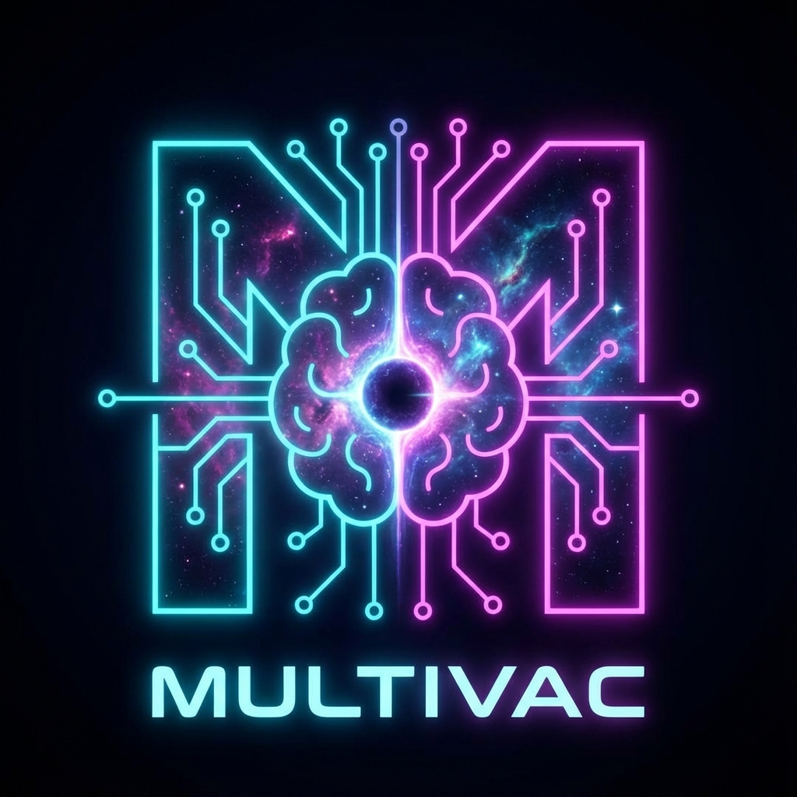
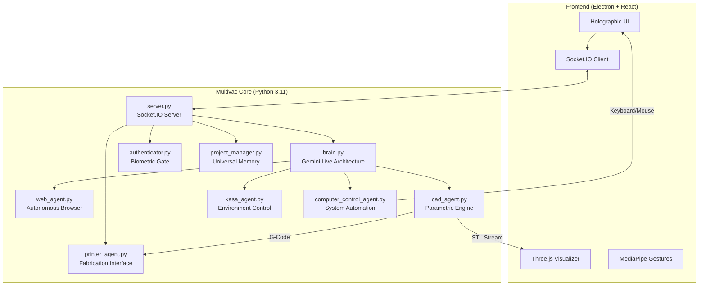

# Multivac AI - The Last Question Answered

<p align="center">
  
</p>


[**📖 View Brand Identity & Vision Deck**](docs/BRAND_DECK.md)

> "The last question was asked for the first time, half in jest, on May 31, 2026..."

**Multivac AI** is a sophisticated AI entity designed for multimodal interaction, evolving from the legendary supercomputer of Asimov's creation. It combines Google's **Gemini 2.5 Native Audio** with computer vision, gesture control, and 3D CAD generation in a unified Electron desktop application.

It is not just an assistant; it is a universal problem solver, capable of managing your smart home, navigating the web, designing physical objects, and answering the deepest queries of existence.

---

## 🌟 Capabilities at a Glance

| Feature | Description | Technology |
| :--- | :--- | :--- |
| **🗣️ Multivac Voice** | Real-time conversation with interrupt handling and authoritative tone | Gemini 2.5 Native Audio |
| **⌨️ Keyboard Control** | System-wide keyboard automation and text input | PyAutoGUI |
| **🖱️ Mouse Control** | Click, move, drag, scroll anywhere on screen | PyAutoGUI |
| **🪟 Window Management** | Launch, close, focus, resize applications | pygetwindow + psutil |
| **🎮 Application Control** | Voice-controlled app launching and management | subprocess + OS integration |
| **🎯 AI Gaming Agent** | Autonomous game playing with vision + control (Coming Soon) | Computer Vision + PyAutoGUI |
| **🧊 Parametric CAD** | Editable 3D model generation from voice prompts | `build123d` → STL |
| **🖨️ 3D Printing** | Slicing and wireless print job submission | OrcaSlicer + Moonraker/OctoPrint |
| **🖐️ Gesture Control** | "Minority Report" style window manipulation | MediaPipe Hand Tracking |
| **👁️ Visual Analysis** | Real-time scene understanding and object recognition | MediaPipe / Gemini Vision |
| **🌐 Web Agent** | Autonomous browser automation | Playwright + Chromium |
| **🏠 Smart Home** | Voice control for Kasa devices | `python-kasa` |
| **🧠 Core Memory** | Asimov's "The Last Question" integrated as foundational context | System Instruction Injection |
| **📁 Universal Memory** | Persistent context across sessions | File-based JSON storage |

### 🖐️ Gesture Control Details
Multivac's interface uses your webcam to detect hand gestures:

| Gesture | Action |
| :--- | :--- |
| **🤏 Pinch** | Confirm action / click |
| **✋ Open Palm** | Release the window |
| **✊ Close Fist** | "Select" and grab a UI window to drag it |

> **Tip:** Enable the video feed window to see the hand tracking overlay.

### 🎯 AI Gaming Agent (Coming Soon)
Multivac will be able to play games autonomously by:
- **Visual Recognition:** Understanding game state through screen capture
- **Strategic Decision Making:** Using AI to determine optimal actions
- **Automated Control:** Executing keyboard/mouse inputs to play
- **Learning & Adaptation:** Improving performance over time

**Potential Use Cases:**
- Automated grinding/farming in RPGs
- Testing game mechanics and balance
- Accessibility assistance for players with disabilities
- Speedrun optimization and route finding
- Tutorial/demonstration creation

---

## 🏗️ Architecture Overview



---

## ⚡ Quick Start

### The "One-Click" Launch (Recommended)
We have provided a unified startup script that handles environment activation and process management.

```powershell
.\start_multivac.bat
```
*This command will check for dependencies, activate the virtual environment, build the frontend, and launch the system.*

---

## 🛠️ Detailed Installation (Beginners)

If you are setting this up from scratch, follow these comprehensive steps.

### Step 1: Install Visual Studio Code
Download and install [VS Code](https://code.visualstudio.com/). This is where you will write code and run commands.

### Step 2: Install Anaconda (The Manager)
Download [Miniconda](https://docs.conda.io/en/latest/miniconda.html).
*Windows Users:* During install, check "Add Anaconda to my PATH environment variable".

### Step 3: Install Git
Download [Git for Windows](https://git-scm.com/download/win).

### Step 4: Get the Code
```bash
git clone https://github.com/moonassetai/multivac-ai.git
cd multivac-ai
```

### Step 5: System Dependencies
**Windows:** No additional system dependencies required!
**MacOS:** `brew install portaudio`

### Step 6: Python Environment
Create the neural core environment:

```bash
conda create -n multivac python=3.11
conda activate multivac

# Install all dependencies
pip install -r requirements.txt

# Install Playwright browsers
playwright install chromium
```

### Step 7: Frontend Setup
Requires **Node.js 18+**.

```bash
# Install frontend dependencies
npm install

# Build the frontend assets
npm run build
```

---

## ⚙️ Configuration Setup

### 1.  API Keys (.env)
Multivac requires access to the Gemini API and ElevenLabs (optional).

1.  Create a file named `.env` in the root folder.
2.  Add your keys:
    ```env
    GEMINI_API_KEY=your_gemini_key_here
    ELEVENLABS_API_KEY=your_elevenlabs_key_here
    ELEVENLABS_VOICE_ID=your_voice_id_here
    ```

### 2. 🔐 Face Authentication (Optional)
To use secure voice features, Multivac needs to know what you look like.

3.  **Place it in `backend/`**: Rename to `reference.jpg`.
4.  **Enable**: Toggle `"face_auth_enabled": true` in `settings.json`.

### 3. 🧠 Local LLM (LM Studio)
Secure, offline text processing using your own hardware.

1.  **Download**: [LM Studio](https://lmstudio.ai/).
2.  **Load Model**: Download any LLM (e.g., Llama 3, Mistral).
3.  **Start Server**: the "Local Server" tab -> "Start Server" (Port 1234).
4.  **Configure**: Set `AI_PROVIDER=LOCAL` in your `.env` file.
5.  **Restart**: Run `start_multivac.bat`.

### 4. 🔥 Firebase Authentication
Secure Google Login for the dashboard.

1.  **Create Project**: Go to [Firebase Console](https://console.firebase.google.com/).
2.  **Enable Auth**: Authentication -> Sign-in method -> Google -> Enable.
3.  **Get Config**: Project Settings -> General -> Your apps -> Config.
4.  **Update File**: Open `src/firebaseConfig.js` and paste your `apiKey`, `appId`, etc.

### 5. 🖨️ 3D Printer Setup
Multivac can slice STL files and send them to your printer (Klipper/Moonraker/OctoPrint).

1.  **Install Slicer**: Install [OrcaSlicer](https://github.com/SoftFever/OrcaSlicer). Multivac detects it automatically.
2.  **Connect**: Open the Printer Window (Cube icon). Multivac scans for printers via mDNS.

---

## 🚀 Running Multivac

### Option 1: Standard Mode (Batch Script)
```powershell
.\start_multivac.bat
```

### Option 2: Developer Mode (Split Terminals)
Use this to see detailed logs for debugging.

**Terminal 1 (Backend Core):**
```bash
conda activate multivac
python backend/server.py
```

**Terminal 2 (Frontend Interface):**
```bash
npm run dev
```

---

## ▶️ Commands & Interaction

### 🗣️ Voice Commands

#### Computer Control
*   "Open Chrome" / "Launch Chrome browser"
*   "Type hello world"
*   "Press Enter" / "Hit the Enter key"
*   "Press Ctrl+C" / "Copy this"
*   "Click" / "Click here"
*   "Move mouse to 500, 300"
*   "Scroll down"
*   "Close Notepad"
*   "Minimize this window"
*   "Show all windows" / "List open windows"
*   "Focus Chrome" / "Switch to Chrome"

#### System & Projects
*   "System check."
*   "Switch project to [Name]."
*   "Turn on the [Room] light."
*   "Create a 3D model of a hex bolt."

### 🧊 3D CAD
*   **Prompt**: "Create a 3D model of a mounting bracket."
*   **Iterate**: "Make the walls thicker."
*   **Files**: Saved to `projects/[ProjectName]/output.stl`.

### 🌐 Web Agent
*   **Prompt**: "Go to Adafruit and find a servo motor under $10."
*   **Note**: The agent will auto-scroll, click, and type. Do not interfere with the browser window while it runs.

---

## ❓ Troubleshooting

### Camera Not Working
*   **Symptoms**: Black video feed or permission errors.
*   **Fix**: Ensure your terminal (VS Code) has **Camera** access in Windows Privacy & Security settings.

### WebSocket Error (1011)
*   **Symptoms**: `websockets.exceptions.ConnectionClosedError: 1011`.
*   **Fix**: This is usually a momentary Gemini API server-side issue. Reconnect or restart the backend.

### Frontend Blank Page
*   **Symptoms**: White screen on load.
*   **Fix**: Ensure you ran `npm run build` or are running `npm run dev`. Check that the backend is running `backend/server.py`.

---

## 📂 Project Structure

```text
multivac-ai/
├── backend/                    # Python server & AI logic
│   ├── brain.py                # Main Brain (Gemini Live API)
│   ├── server.py               # FastAPI + Socket.IO server
│   ├── cad_agent.py            # CAD generation orchestrator
│   ├── printer_agent.py        # 3D printer discovery & slicing
│   ├── web_agent.py            # Playwright browser automation
│   ├── kasa_agent.py           # Smart home control
│   ├── computer_control_agent.py  # System-wide keyboard/mouse control
│   └── tools.py                # Tool definitions
├── src/                        # React frontend
│   ├── App.jsx                 # Main application component
│   └── components/             # UI components
├── projects/                   # User project data (auto-created)
├── start_multivac.bat          # Unified startup script
├── requirements.txt            # Python dependencies
└── README.md                   # System Documentation
```

---

## 📄 License
This project is licensed under the **MIT License**.

<p align="center">
  <strong>Multivac AI</strong><br>
  <em>Bridging AI, CAD, and Vision in a Single Interface</em><br>
  Built with 🤖 by <strong>OKI Moon</strong>
</p>
